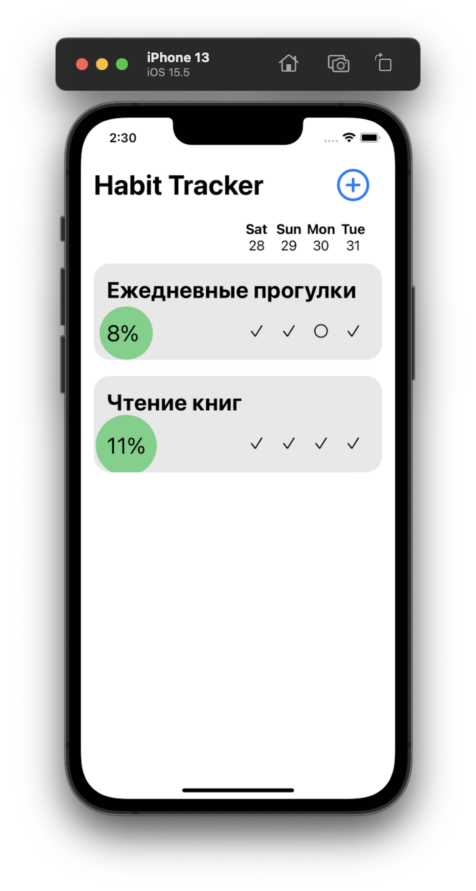
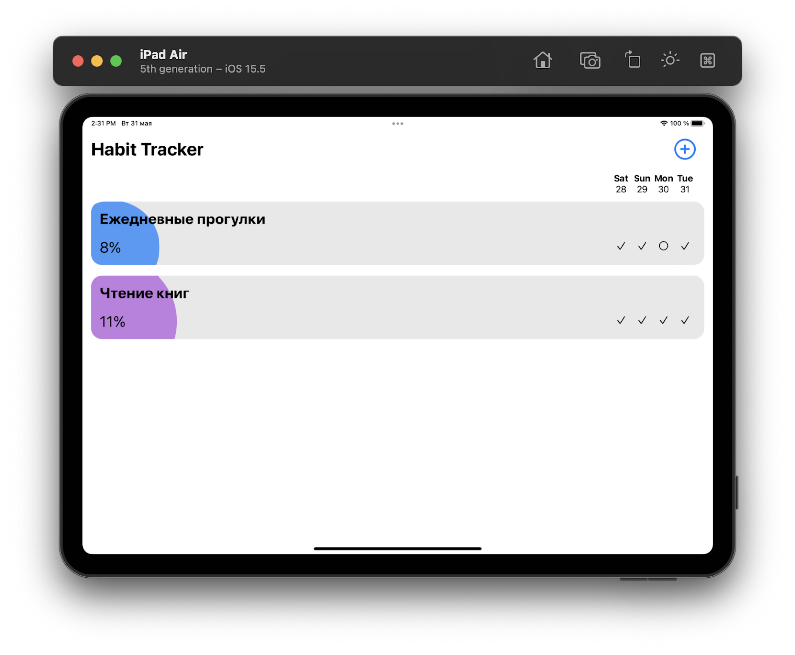

# Habit Tracker Application

## User-experience

The application provides an easy-to-use interface for habit tracking.

You may add as many habits as you want for tracking.

For each of them you may tick the days you completed and program will calculate your score for the habit (last 4 days are available for changing). 

It is possible to choose different frequency modes (from 1 times a week up to everyday mode). Based on this decision program will use different formulas to calculate the score.

It takes approximately 80 days to reach 100\% score for each mode.

## Interface and development

We used Swift and the SwiftUI framework for developing. The interface is optimized for any screen resolutions.

There are several windows available:
 - Main screen with general information about the habit
 - Detailed screen for each habit with several progress bars and the progress graph.
 - Creation screed for making new habits and choosing settings. 

Here are some examples:

### Vertical view (Main screen)

### Horizontal view (Main screen)

## Usage demonstration

In this video you may see all the functionality of the application:
 - Habit creation 
 - Changing settings of the current habit 
 - Archiving habits
 - Different views of habit details

<video src="docs/content/demonstration.mov" controls="controls" style="max-width: 400px;">
</video>
